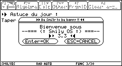
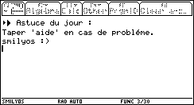
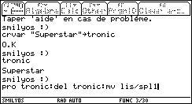

# smilyos
A command line in French for TI-92 calculators.

## Starting SmilyOS

Just type `smos()` and ENTER.

## Available commands

- **aide**: shows help (`aide`)
- **app**: shows applications menu (`app`)
- **cd**: change directory (`cd documents`)
- **code**: lock the screen. A password is required to unlock (`code`)
- **config**: configure the command line (`config`)
- **copie**: copy a variable, aka a file (`copy var1 var2`)
- **crdir**: create a directory (`crdir mydir`)
- **crvar**: create a variable, aka a file (`crvar "value"->varName`)
- **del**: delete a variable (`del var3`)
- **delcd**: delete a directory (`delcd mydir`)
- **dep**: move a variable (`dep`)
- **depro**: remove write protection on a variable (`depro var4`)
- **dir**: display info about a variable (`dir var5`)
- **fin**: exit SmilyOS (`fin`)
- **info**: display information about your TI-92 (`info`)
- **mv**: display or edit a variable (`mv lis/var6` or `mv edit/var6`)
- **p**: pause SmilyOS, similar to the sleep command from Bash (`pause`)
- **path**: set the $PATH variable (`path`)
- **pro**: set a variable to read-only (`pro var7`)
- **r**: re-run the latest command line (`r`)
- **ren**: rename a variable (`ren var8,var9`)
- **tme**: credits (`tme`)

SmilyOS can chain instructions and execute them sequentially: `aide:tme:mv lis/guide1:mv lis/spl1`
